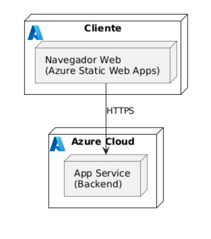

# Shipwreckeds - Backend (Spring Boot)

Backend de la aplicación "Shipwreckeds". Provee **autenticación** (AWS Cognito), **gestión de partidas** y el **motor de juego** con soporte para comunicación en tiempo real vía **WebSocket/STOMP**.

---

## Descripción general

Shipwreckeds es un **juego multijugador** con comunicación en tiempo real. El backend está implementado con **Spring Boot** y ofrece las siguientes funcionalidades clave:

* **Autenticación** y gestión de usuarios (usando AWS Cognito).
* **API REST** para creación y consulta de partidas.
* **Motor de juego** (`GameEngine`) que procesa comandos, gestiona eventos y el estado de la partida.
* **Comunicación en tiempo real** a través de WebSocket usando el protocolo STOMP para manejar eventos de baja latencia (movimientos, chat, votaciones).

---

## Tecnologías utilizadas

El proyecto está construido principalmente con el ecosistema Java/Spring.

| Categoría | Tecnología | Versión/Detalle |
| :--- | :--- | :--- |
| **Lenguaje** | Java | 11+ (ver `pom.xml`) |
| **Framework** | Spring Boot | Módulos Web, WebSocket, Security |
| **Mensajería** | WebSocket | Comunicación full-duplex de baja latencia |
| **Protocolo** | STOMP | Capa de mensajería estructurada (pub/sub) sobre WebSocket |
| **Autenticación** | AWS Cognito | Autenticación y gestión de identidad de usuarios |
| **Gestor de dependencias** | Maven | Compilación y gestión del proyecto |
| **Cliente (Referencia)** | Frontend existente en carpeta `front/` | Probablemente Vite/React (ver `front/` para detalles) |

---

## Arquitectura general

La arquitectura está diseñada para soportar interacciones bidireccionales de baja latencia.

### Flujo de comunicación

1.  **REST:** El Cliente se comunica a través de **API REST** para tareas iniciales (Autenticación, creación/consulta de partidas).
2.  **WebSocket/STOMP:** El Cliente establece una conexión **WebSocket/STOMP** con el `GameEngine` para el intercambio de eventos en tiempo real (movimientos, chat, votaciones).
    * **Clientes** se suscriben a tópicos (`/topic/game/{matchId}`) para recibir el estado del juego (broadcast).
    * **Clientes** envían comandos a destinos de aplicación (`/app/move`, `/app/chat`) para interactuar con la partida.
    * El **`GameEngine`** procesa comandos y publica actualizaciones de estado.

### Decisiones de Arquitectura de Comunicación

| Decisión | Justificación | Beneficio Práctico |
| :--- | :--- | :--- |
| **Comunicación en tiempo real: WebSocket** | Provee un canal full-duplex persistente, esencial para actualizaciones frecuentes y respuesta rápida en un juego multijugador. Reduce la sobrecarga de `polling`. | Menor latencia, mejor experiencia de usuario. |
| **Protocolo de mensajería: STOMP sobre WebSocket** | Añade una capa estructurada (tópicos, colas lógicas, suscripciones) que facilita el diseño de eventos *pub/sub* del juego. | Enrutamiento sencillo por destino, control de suscripciones por sesión, simplifica la integración con Spring. |
| **Broker y escalabilidad (Inicial)** | Se usa el broker simple/embebido de Spring para facilitar el desarrollo inicial. | Desarrollo rápido. Para escalabilidad horizontal, se recomienda integrar un broker externo (p. ej. RabbitMQ, ActiveMQ o un broker Redis). |
| **Autenticación en WebSocket** | La conexión se establece después de la autenticación REST/Cognito. Se aplican reglas de acceso sobre destinos/STOMP headers. | Seguridad: evita que usuarios no autorizados envíen o se suscriban a canales restringidos. |

### Diagramas Arquitectónicos

* **Diagrama de Clases**


    
* **Diagrama de Componentes**
    


* **Diagrama de Despliegue**
    


---

## Requerimientos funcionales

El backend soporta la lógica de un juego multijugador con elementos de simulación y rol.

* **Autenticación de usuarios:** Permitir a los usuarios iniciar sesión a través de AWS Cognito.
* **Gestión de partidas (`MatchService`):**
    * Creación de nuevas partidas.
    * Unión de jugadores a partidas existentes.
    * Control del estado y finalización de partidas.
* **Motor de juego (`GameEngine`):**
    * Procesamiento de comandos de movimiento y acciones de los jugadores.
    * Cálculo y `broadcast` del estado actual de la partida.
* **Interacción en tiempo real:** Soporte para chat, movimientos de jugadores, eventos de votación y cambios de estado de combustible (`Fuel War`).
* **Gestión de roles y NPCs:**
    * Manejo de roles y permisos de jugadores (`RoleService`).
    * Manejo de personajes no jugadores (`NpcService`).

---

## Requerimientos no funcionales

* **Disponibilidad y Concurrencia:** La arquitectura debe soportar interacciones en tiempo real de múltiples jugadores simultáneos por partida, manteniendo baja latencia.
* **Seguridad:** Las conexiones REST y WebSocket deben validar la autenticación (JWT/Tokens de Cognito) y aplicar autorización.
* **Escalabilidad:** Debe permitir la migración a un broker de mensajería externo (RabbitMQ, Redis) para el escalado horizontal de múltiples instancias del backend.

---

## Restricciones tecnológicas

* **Plataforma de desarrollo:** Java y Spring Boot.
* **Autenticación:** Uso de AWS Cognito para la identidad.
* **Comunicación en tiempo real:** Restringida al uso de WebSocket con STOMP.

---

## Supuestos arquitectónicos

* **Conexión estable de los jugadores**
El diseño del sistema asume que los clientes mantienen una conexión relativamente estable para garantizar la coherencia de los eventos en tiempo real (movimientos, chats, votaciones).
Esto permite evitar sobrecargar la arquitectura con mecanismos avanzados de reconexión, buffering o replicación de eventos diferidos.
Si bien existen estrategias de reconexión automática, la lógica principal del juego se construye bajo el supuesto de que los cortes de red serán excepcionales y breves.

* **Prioridad al tiempo real por encima de latencia mínima**
El sistema valora la consistencia temporal de los eventos más que la latencia absoluta.
Esto significa que, aunque se optimiza para transmitir eventos rápidamente, se prioriza que todos los jugadores reciban las actualizaciones en el mismo orden y sin inconsistencias**, incluso si esto añade milisegundos adicionales en sincronización interna.
Este enfoque es clave para garantizar un juego justo en entornos multijugador donde los eventos simultáneos pueden impactar decisiones o votaciones.

* **Partidas no persistentes (TTL en Redis)**
Las partidas se consideran efímeras y su estado no requiere persistencia a largo plazo.
Redis se utiliza para almacenar estados temporales con un TTL que elimina automáticamente la información una vez finalizada o abandonada la sala, lo que reduce costos de almacenamiento, evita acumulación de datos, y simplifica la lógica de limpieza.
Este supuesto permite optimizar el rendimiento del backend y mantener la arquitectura ligera, enfocada únicamente en los datos activos del momento.

---

## Flujo completo del juego

1.  El usuario accede al frontend y es **redirigido a AWS Cognito** (Hosted UI) para iniciar sesión.
2.  Tras la autenticación, el frontend recibe los **tokens** (ID/Access).
3.  El cliente utiliza estos tokens para:
    * Realizar llamadas **REST** (p. ej., crear o unirse a partidas).
    * Establecer la conexión **WebSocket/STOMP**.
4.  Una vez conectado a WebSocket, el cliente se **suscribe** a los tópicos de la partida para recibir el estado (`/topic/game/{matchId}`).
5.  El cliente envía **comandos** al servidor (`/app/move`, `/app/chat`).
6.  El **`GameEngine`** procesa estos comandos y publica las actualizaciones de estado de vuelta a todos los clientes suscritos.
7.  El `MatchService` controla la creación, estado y finalización de partidas.

### Diagramas de Actividades

* **Flujo Fuel War**

.png>)

* **Flujo Votación**
    
.png>)


### Diagramas de Secuencia


---

## Estructura de carpetas

```text
src/
└── main/
    ├── java/
    │   └── com/arsw/shipwreckeds/
    │       ├── ShipwreckedsBackendApplication.java    # Aplicación principal
    │       ├── config/
    │       │   └── WebSocketConfig.java               # Configuración de WebSocket y STOMP
    │       ├── controller/                            # Controladores REST y WebSocket/STOMP
    │       │   ├── AuthController.java
    │       │   ├── MatchController.java
    │       │   ├── GameController.java
    │       │   └── WebSocketController.java
    │       ├── service/                               # Lógica de negocio y motor de juego
    │       │   ├── AuthService.java
    │       │   ├── MatchService.java
    │       │   ├── GameEngine.java                    # Motor principal del juego
    │       │   ├── NpcService.java
    │       │   └── RoleService.java
    │       ├── model/                                 # Clases de dominio y DTOs
    │       │   ├── Match.java
    │       │   ├── Player.java
    │       │   ├── ChatMessage.java
    │       │   ├── Position.java
    │       │   ├── Task.java
    │       │   ├── Npc.java
    │       │   ├── MatchStatus.java
    │       │   └── dto/                               # DTOs (LoginRequest, GameState, etc.)
    │       └── ...
    └── resources/
        └── application.properties                     # Configuración general y de Cognito

```
---

## Cómo ejecutar el proyecto

### Requisitos

* **Java 11+** (o la versión especificada en `pom.xml`)
* **Maven**


###  Compilación y Ejecución

Compilar el proyecto (ignorar tests si es necesario):

```sh
mvn clean package -DskipTests
Ejecutar el backend:

Bash

# Opción 1: Ejecutar el JAR generado
java -jar target/shipwreckeds-backend-*.jar

# Opción 2: Ejecutar directamente con Spring Boot Maven Plugin
mvn spring-boot:run
Pruebas
El proyecto incluye tests básicos que se pueden ejecutar con Maven.

Ejecución de Pruebas
Bash

# Ejecutar todos los tests unitarios y de integración
mvn test

# Ejecutar un test específico (ejemplo)
mvn -Dtest=ShipwreckedsBackendApplicationTests test
Test base: com.arsw.shipwreckeds.ShipwreckedsBackendApplicationTests

